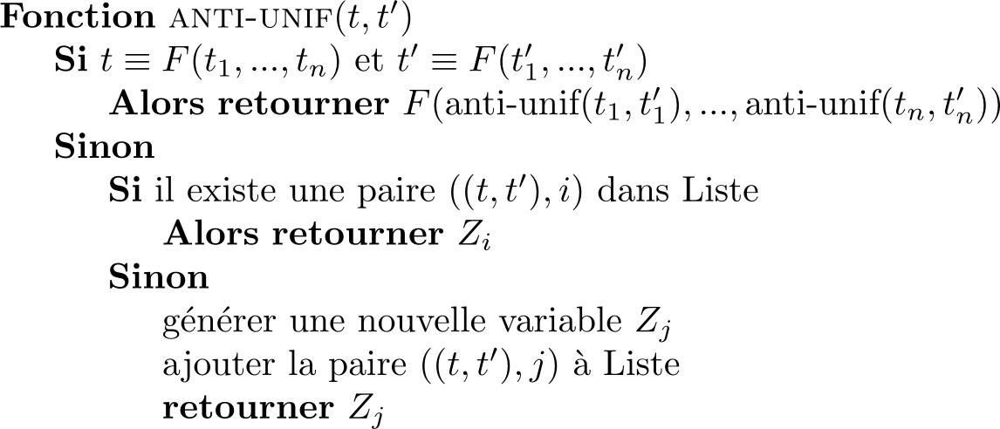

# Ocaml_Proj

Ceci est un projet de Programmation Fonctionnelle en binôme qui vise à implémenter les algorithmes d'unification et d'anti-unification de termes du 1er ordre en OCaml.

## Algorithme d'unification

TODO

## Algorithme d'anti-unification

Pour `t` et `t'` des termes du 1er ordre et `F` une fonction



La forme d'un terme de 1er ordre dans le programme est comme ceci :

- Variable : `Var "nom"`
- Fonction : `Func("nom", [ <arguments> ])`

Par exemple : 

```ocaml
utop # unif (Func("f", [Var "Y"; Var "Y"])) (Func("f", [Var "a"; Var "b"]));;
    - : po = Func ("f", [Var "a"; Var "a"])
```
